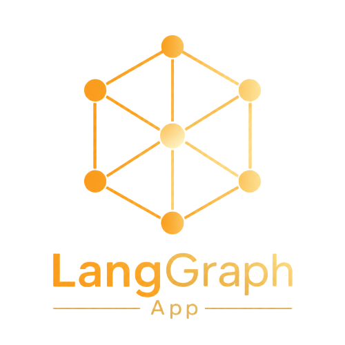

<p align="center">
  
</p>

<h1 align="center">LangGraph App</h1>

<p align="center">
  <a href="README.md">English</a> | <a href="README-CN.md">简体中文</a>
</p>

<p align="center">
  一个可私有化部署的 AI 对话应用（本仓库：<code>langgraph-app</code>）。它基于 <a href="https://langchain-ai.github.io/langgraphjs/">LangGraph</a> 的 <code>StateGraph</code> Agent 实现流式 Token 响应，结合 <a href="https://github.com/assistant-ui/assistant-ui">assistant-ui</a> React 对话界面，并将持久化会话与 Checkpoint 对话状态存储于 Postgres 中。
</p>

## 特性

- **流式对话 UI**：基于 assistant-ui 的 `Thread` 组件构建。
- **LangGraph 后端**：双 compiled Graph 并行运行 — 主对话图（`agent`：包含路由 Router + 子 Agent + `triggerBackgroundAgent`）以及轮次结束异步图（`backgroundAgent`：包含 `touchLastMessage` + `summarize` 线程总结）。主对话流不会被后台任务阻塞，`triggerBackgroundAgentNode` 通过 SDK HTTP 异步调度并立即返回。
- **持久化会话与 Checkpoint**：基于 Postgres 的会话与状态检查点存储，关闭标签页不会丢失上下文。
- **跨会话长期记忆**：模型可调用 `save_memory` 保持用户持久事实（针对 `[userId, "memory"] main` 进行 RFC 6902 JSON 补丁更新）；记忆召回中间件会在每次调用时将 `<memory>`（个人偏好与认证信息）及 `<threads>`（压缩的历史 Q&A 总结）注入到 SystemMessage 中。长对话线程通过基于 Store 的 `threadSummarizeNode` 触发器，将 K 轮对话窗口压缩为 `SummaryEntry` 记录。用户可在 Memory 设置选项卡中查看与删除。详见 [docs/MEMORY.md](docs/MEMORY.md)。
- **完全可私有化部署**：支持使用 Docker Compose 单 VPS 部署，无 SaaS 平台绑定。
- **类型安全的数据库层**：基于 Drizzle ORM + Zod 校验器，单一 Schema 源头驱动。
- **TDD 测试驱动开发**：使用 Vitest 结合独立的测试数据库进行全自动化测试。
- **用户账号系统**：支持邮箱+密码注册（含邮箱验证）、GitHub 与 Google OAuth 快捷登录、7 天持久 Session，以及基于用户的会话隔离。运维指南详见 [docs/AUTH.md](docs/AUTH.md)。
- **工具调用 Agent (Tool-Using Agent)**：每个子 Agent 均绑定了 `search_web` (Jina Search)、`fetch_url` (Jina Reader)、`save_memory` 以及特定领域的专业工具（天气 / 加密货币 / 代码）。卡片交互契约详见 [docs/TOOLS.md](docs/TOOLS.md) 与 [docs/INTERRUPT.md](docs/INTERRUPT.md)。
- **加密货币子 Agent**：支持实时币价查询、NFT 持仓展示（基于 Alchemy Portfolio 5 链画廊）以及基于自动充值 Mock Coin 余额的模拟 DEX 兑换流程。
- **可观测性面板 (Observability Panel)**：每一次 LLM / Tool / Chain / Node 调用的 Span 都会被 `BaseCallbackHandler` 捕获并持久化到 Postgres `observability_spans` 表中。AI 消息旁提供图标按钮，一键打开单轮瀑布流（运行耗时、Token 消耗、父子嵌套 Span）。列表端点经过服务端聚合，点击行可延迟加载全量 Span 详情。详见 [docs/OBSERVABILITY.md](docs/OBSERVABILITY.md)。
- **对话附件处理**：基于 assistant-ui 的 `AttachmentAdapter` 结合 Cloudflare R2 预签名 PUT URL — 浏览器直传文件到 R2，无需经过 Next.js 服务端中转。未配置环境变量时自动懒加载注册。详见 [docs/ATTACHMENTS.md](docs/ATTACHMENTS.md)。
- **知识库与混合检索 (Knowledge Base & Hybrid Search)**：支持 7 种数据源解析（PDF、图片、纯文本、Markdown、DOCX、XLSX、PPTX）及粘贴 URL — PDF 与图片通过 Vision OCR 解析，Office 格式由 `officeparser` 提取结构化文本及嵌入图片上传至 R2。支持分块、向量嵌入、实体/关系/主题提取、基于 pgvector 的三路 RRF (关键词、向量、标签) 混合检索、语义重排序 (Cohere/Jina)、`@` 符号指定文档引用、动态 Token 预算缩放与迭代检索。详见 [docs/KNOWLEDGE_BASE.md](docs/KNOWLEDGE_BASE.md)。
- **级联意图路由 (Tiered Intent Router)**：采用 Tier 1 结构规则短路 (文件/PDF) $\rightarrow$ Tier 2 优先词汇表/正则引擎短路 $\rightarrow$ Tier 3 LLM 结构化输出降级的 3 层级联架构，最小化响应延迟与 Token 消耗，并全程标记决策来源 (`rule` | `keyword` | `llm`)。详见 [docs/ROUTING.md](docs/ROUTING.md)。
- **单次 LLM 调用额度限制**：基于 UTC 滚动窗口与 `role.creditLimit` / `role.windowHours` 进行实时计费拦截。由 `/api/[..._path]` 代理层统一拦截，触发限额时合成 `show_credit_card` SSE 流，并在前端渲染额度已满卡片。后台记录日志 backing 用户设置页与管理员额度配置。详见 [docs/CREDIT.md](docs/CREDIT.md)。
- **管理员控制台 (Admin Console)**：单页 `/admin` 包含三大选项卡 — Providers（模型注册表 + 加密 API Key + 计费单价）、Roles（角色额度上限 + 窗口时长）、Users（角色分配、封禁与 Session 立即撤销）。首个管理员通过 `INITIAL_ADMIN_EMAIL` 自动引导。详见 [docs/ADMIN.md](docs/ADMIN.md)。
- **Agent 评测工作室 (Agent Evaluation Studio)**：包含评测工作室 (/admin/eval)、Rubric 规则编辑器、在线 Execution 瀑布流以及由独立 `evalAgent` 图编排的 LLM-as-a-Judge 评估器。预置 11 个 Agent ID 的专属 Rubric 规则与英文 Benchmark 数据集。详见 [docs/EVALUATION.md](docs/EVALUATION.md)。

## 技术栈

| 架构层       | 选型                                                                  |
| ------------ | --------------------------------------------------------------------- |
| Agent 运行时 | LangGraph.js (`StateGraph`)                                           |
| LLM 客户端   | `@langchain/openai`（兼容 OpenAI 协议）                               |
| UI 框架      | assistant-ui (`useLangGraphRuntime`) + Tailwind v4 + shadcn/ui 组件库 |
| 应用框架     | Next.js 16 (App Router, Turbopack)                                    |
| ORM          | Drizzle ORM + postgres-js                                             |
| API 校验     | Zod (直接通过 `drizzle-zod` 从 Drizzle Schema 派生)                   |
| 数据库       | Postgres 16                                                           |
| 测试框架     | Vitest（配合真实的 Postgres 测试数据库）                              |

## 在线体验

- **演示 Demo**：<https://ai.firetable.tech> — 部署了本仓库代码的在线演示环境。支持任意邮箱注册；首个匹配 `INITIAL_ADMIN_EMAIL` 的账号将自动升级为管理员。
- **开源仓库**：<https://github.com/FireTable/langgraph-app>

## 快速开始

### 前置条件

- Node.js 22（由 `langgraph.json` 锁定）
- pnpm 10+
- Postgres 16（本地安装或 Docker 运行）

### 1. 安装 Postgres 并创建数据库

```bash
# macOS (Homebrew)
brew install postgresql@16
brew services start postgresql@16

createdb langgraph_app
createdb langgraph_app_test
```

或者使用 Docker：

```bash
docker run -d --name pg-dev -e POSTGRES_PASSWORD=dev -p 5432:5432 postgres:16-alpine
createdb -h localhost -U postgres langgraph_app
createdb -h localhost -U postgres langgraph_app_test
```

### 2. 配置环境变量

```bash
cp .env.example .env.local
```

在 `.env.local` 中填入必要的配置：

```bash
# OpenAI 兼容模型配置
OPENAI_API_KEY=sk-...
OPENAI_BASE_URL=https://api.openai.com/v1   # 或自定义 Gateway

# Jina API Keys（用于 Web 搜索与网页抓取，可在 jina.ai/reader 免费申请）
JINA_API_KEYS=jina_abc,jina_def

# 本地 Postgres 数据库连接串
DATABASE_URL=postgresql://FireTable@localhost:5432/langgraph_app
```

`.env.test`（在 `NODE_ENV=test` 下供 Vitest 使用）：

```bash
DATABASE_URL_TEST=postgresql://FireTable@localhost:5432/langgraph_app_test
```

### 3. 安装依赖并运行数据库迁移

```bash
pnpm install
pnpm db:migrate
```

`pnpm db:migrate` 会针对 `DATABASE_URL` 执行 `drizzle-kit migrate`。首次迁移会创建 `threads` 等应用表；而 LangGraph 框架自带的 `checkpoints` / `checkpoint_blobs` / `checkpoint_writes` 表会在后端启动时由 `PostgresSaver.setup()` 自动创建。

### 4. 启动开发服务器

```bash
pnpm dev
```

- `localhost:2024` — LangGraph 后端服务
- `localhost:3000` — Next.js 前端应用（将 `/api/*` 代理转发至 LangGraph）

打开 `http://localhost:3000` 即可开始对话。

## 项目目录结构

```
app/                          Next.js App Router 路由
  page.tsx                    全屏入口页面，渲染 <Assistant />
  assistant.tsx               useLangGraphRuntime 与对话列表适配器绑定
  api/                        HTTP 接口路由 (详见 docs/APIS.md)
    [..._path]/route.ts       转发至 LANGGRAPH_API_URL 的 Node 代理 (含与身份校验与额度拦截)
    threads/                  会话 Thread CRUD 与可观测性子路由
    memory/                   个人偏好与对话总结删除接口
    credit/                   额度状态与历史记录接口 (面向用户)
    admin/                    Providers / Roles / Users 管理接口 (仅限管理员)
    alchemy/                  Alchemy JSON-RPC 代理与 Key 状态接口

backend/
  agent.ts                    主对话图 (Router + 子 Agent + triggerBackgroundAgent)
  background-agent.ts         后台异步图 (touchLastMessage + summarize)
  state.ts                    RouterAgentState + CommonAgentState 状态定义
  model.ts                    getChatModel() — 支持数据库模型注册表与环境兜底的 ChatOpenAI 工厂
  checkpointer.ts             PostgresSaver (LangGraph Checkpoint 检查点表)
  store.ts                    共享 PostgresStore (用于 Memory 与对话总结)
  callbacks.ts                双图共享的单例 Handler (CapturingHandler + CreditTrackingHandler)
  agent/
    chat-agent.ts             chatAgent 编译子图 (Model ↔ Tools 循环)
    weather-agent.ts          weatherAgent 天气子图
    crypto-agent.ts           cryptoAgent 加密货币子图
    code-agent.ts             codeAgent 代码执行子图
    eval-agent.ts             evalAgent 评测子图 (LLM-as-a-Judge)
  node/
    call-model-node.ts        "agent" 节点 — 调用模型并追加 AI 响应
    rename-thread-agent-node.ts "renameThreadAgent" — 自动生成并持久化会话标题
    router-agent-node.ts      "routerAgent" — 3 层级联路由节点
    trigger-background-agent-node.ts "triggerBackgroundAgent" — 异步触发 backgroundAgent
    thread-summarize-node.ts  "summarize" — 将 K 轮对话压缩为 SummaryEntry
  tool/                       绑定的 LangChain 工具组
    web-search.ts             search_web — Jina Search
    web-fetch.ts              fetch_url — Jina Reader
    memory/save-memory-tool.ts save_memory — 用户 Profile RFC 6902 补丁更新
  memory/
    recall.ts                 loadMemory / getCachedMemory (LRU max 1000, 60s TTL)
    template.ts               buildSystemMessageWithMemory (注入 <memory> 与 <threads>)
  router/
    keywords.ts               优先级词汇表与正则匹配短路引擎 (Tier 2 Router)

components/
  assistant-ui/               对话 UI 原语 (thread, markdown, reasoning...)
  observability/              可观测性面板组件 (按钮、侧边栏、Waterfall 瀑布流)
  tool-ui/                    工具调用卡片 (weather / crypto / code / memory / credit)
  ui/                         shadcn/ui 基本组件
  settings/                   Memory 与 Credit 设置选项卡
  credit/                     CreditProgress 进度条与卡片头部
  auth/                       认证 Shell 与用户按钮 UI

lib/
  utils.ts                    cn() 样式合并工具
  constants.ts                全局常量 (APP_NAME, DEFAULT_THREAD_TITLE)
  jina.ts                     Jina API Key 内存池与轮询告警处理
  router/                     路由 Helper 模块
    keywords.ts               意图识别与规则库定义
  threads/                    会话模块 (Schema, CRUD, Adapter)
  memory/                     记忆模块 (查询、校验、合并逻辑)
  eval/                       Agent 评测工作室模块
  observability/              可观测性模块 (Schema, 转换, 聚合逻辑)
  credit/                     额度计费模块 (Schema, 校验, 记录逻辑)
  provider/                   模型提供商注册表模块
  auth/                       Better Auth 认证与 RBAC 权限管理

db/                           数据库根目录
  schema.ts                   所有模块 Schema 的汇总导出
  client.ts                   单例 Drizzle 客户端 (postgres-js 连接池)
  migrations/                 Drizzle-kit 自动生成的迁移 SQL 文件

tests/                        Vitest 测试目录 (NODE_ENV=test)
  setup.ts                    全局 Setup：自动在测试库运行迁移
  api/                        接口路由测试
  backend/                    Graph 图与 Node 节点测试
  db/                         数据库迁移测试
  frontend/                   前端组件测试
  lib/                        核心 Helper 模块单元测试 (credit, provider, auth, router...)
```

## 数据库架构

数据持久化分为三大层级（均基于 Postgres）：

### 1. 应用数据表 (App Tables)

由 `lib/<module>/schema.ts` 维护。完整字段说明参阅 [`docs/DB.md`](docs/DB.md)。

- **`user`, `session`, `account`, `verification`** — Better Auth 账号与认证表。
- **`threads`** — 对话会话表，包含标题、状态及最后更新时间。
- **`attachments`** — 基于 Cloudflare R2 的附件元数据表（详见 [`docs/ATTACHMENTS.md`](docs/ATTACHMENTS.md)）。
- **`role`** — 角色与额度上限表（`credit_limit`, `window_hours`）。
- **`provider`** — LLM 模型提供商注册表（加密存储 API Key 与模型单价）。
- **`credit_usage_log`** — LLM 调用计费日志表。
- **`eval_*` / `prompt_*`** — Agent 评测工作室、提示词版本控制及 A/B 分流配置表。

### 2. LangGraph 检查点表 (Checkpoints)

后端启动时由 `PostgresSaver.setup()` 自动创建：`checkpoints`, `checkpoint_blobs`, `checkpoint_writes` 以及迁移日志表 `__drizzle_migrations`。

## 开发与常用命令

| 命令                | 说明                                       |
| ------------------- | ------------------------------------------ |
| `pnpm dev`          | 同时启动 Next.js 前端与 LangGraph 后端服务 |
| `pnpm dev:frontend` | 仅启动 Next.js 前端 (端口 3000)            |
| `pnpm dev:backend`  | 仅启动 LangGraph 后端 (端口 2024)          |
| `pnpm build`        | 构建生产环境前端产物                       |
| `pnpm start`        | 运行生产环境构建                           |
| `pnpm lint`         | 执行 oxlint + oxfmt `--check`              |
| `pnpm format:fix`   | 使用 oxfmt 自动格式化代码                  |
| `pnpm test`         | 执行一次性 Vitest 单元测试                 |
| `pnpm test:watch`   | 启动 Vitest 监听模式                       |
| `pnpm db:generate`  | 根据 Drizzle Schema 生成迁移文件           |
| `pnpm db:migrate`   | 将未应用的迁移应用至 `DATABASE_URL`        |
| `pnpm db:studio`    | 打开 Drizzle Studio 数据库可视化面板       |

## 测试规范

`pnpm test` 会自动设置 `NODE_ENV=test`，使 `@next/env` 加载 `.env.test`。在所有测试运行前，`tests/setup.ts` 会自动将全量迁移应用至测试数据库。每个测试文件会在 `beforeEach` 中自动清空相关数据表。

## 环境变量参考

| 变量名                   | 作用模块                   | 是否必须                                                                      |
| ------------------------ | -------------------------- | ----------------------------------------------------------------------------- |
| `OPENAI_API_KEY`         | 后端 Agent                 | 可选（数据库 `provider` 表为空时的初始兜底 Key；后续通过 Admin 面板加密管理） |
| `OPENAI_MODEL`           | 后端 Agent                 | 可选（默认 `gpt-4o-mini`）                                                    |
| `OPENAI_BASE_URL`        | 后端 Agent                 | 可选（自定义 API Gateway）                                                    |
| `JINA_API_KEYS`          | 网页搜索与抓取             | 是（支持英文逗号分隔的密钥池）                                                |
| `ALCHEMY_API_KEY`        | NFT 画廊                   | 是（用于 `get_NFT_holdings`）                                                 |
| `LANGGRAPH_API_URL`      | Next.js 代理               | 可选（默认 `http://localhost:2024`）                                          |
| `DATABASE_URL`           | Drizzle ORM                | 是                                                                            |
| `DATABASE_URL_TEST`      | Vitest                     | 是                                                                            |
| `BETTER_AUTH_SECRET`     | 身份认证 Cookie 加密       | 是（详见 [docs/AUTH.md](docs/AUTH.md)）                                       |
| `LLM_KEY_ENCRYPTION_KEY` | API Key 加密 (AES-256-GCM) | 是（32 字节 Hex 字符串，由 `openssl rand -hex 32` 生成）                      |
| `INITIAL_ADMIN_EMAIL`    | 引导管理员邮箱             | 可选（匹配该邮箱的首位注册用户将自动赋予 admin 角色）                         |
| `RESEND_API_KEY`         | 邮件发送服务               | 是                                                                            |
| `R2_*`                   | Cloudflare R2 附件存储     | 是（开启附件上传功能需配置，详见 [docs/ATTACHMENTS.md](docs/ATTACHMENTS.md)） |

## 文档索引

- [`docs/APIS.md`](docs/APIS.md) — HTTP 接口文档。
- [`docs/ROUTING.md`](docs/ROUTING.md) — 意图识别与 3 层级联路由器设计（Rule 短路、Keyword 短路、LLM 降级）。
- [`docs/MEMORY.md`](docs/MEMORY.md) — 记忆系统与对话总结设计。
- [`docs/KNOWLEDGE_BASE.md`](docs/KNOWLEDGE_BASE.md) — 知识库与三路 RRF 混合检索架构。
- [`docs/OBSERVABILITY.md`](docs/OBSERVABILITY.md) — 可观测性面板与 Span 追踪架构。
- [`docs/TOOLS.md`](docs/TOOLS.md) — 工具库与前端卡片契约。
- [`docs/INTERRUPT.md`](docs/INTERRUPT.md) — 中断式工具调用流程 (Ask Location, Wallet, Swap)。
- [`docs/AUTH.md`](docs/AUTH.md) — 认证与 RBAC 权限系统配置指南。
- [`docs/ATTACHMENTS.md`](docs/ATTACHMENTS.md) — 基于 Cloudflare R2 的附件上传方案。
- [`docs/DB.md`](docs/DB.md) — 数据库 Schema 字段级说明。
- [`docs/EVALUATION.md`](docs/EVALUATION.md) — Agent 评测工作室与 LLM-as-a-Judge 评估机制。
- [`docs/CREDIT.md`](docs/CREDIT.md) — 计费与额度上限控制。
- [`docs/ADMIN.md`](docs/ADMIN.md) — 管理员控制台使用指南。
- [`docs/DEPLOY.md`](docs/DEPLOY.md) — 部署与运维指南。

## 技能与运维

`skills/` 目录下包含了 **Claude Code 技能文件**，提供自动化部署与维护指引：

- [`skills/langgraph-app-maintain.md`](skills/langgraph-app-maintain.md) — VPS 部署、镜像升级、回滚与数据库重置维护指引。

## 工程规范

详见 `CLAUDE.md`：

- API 文档必须与代码保持同步（Per-commit 维护）。
- 任何新功能、新路由与 Schema 变更必须采用 TDD 编写测试。
- 优先选择标准、通用的工程解法，避免临时性的 Hack。
